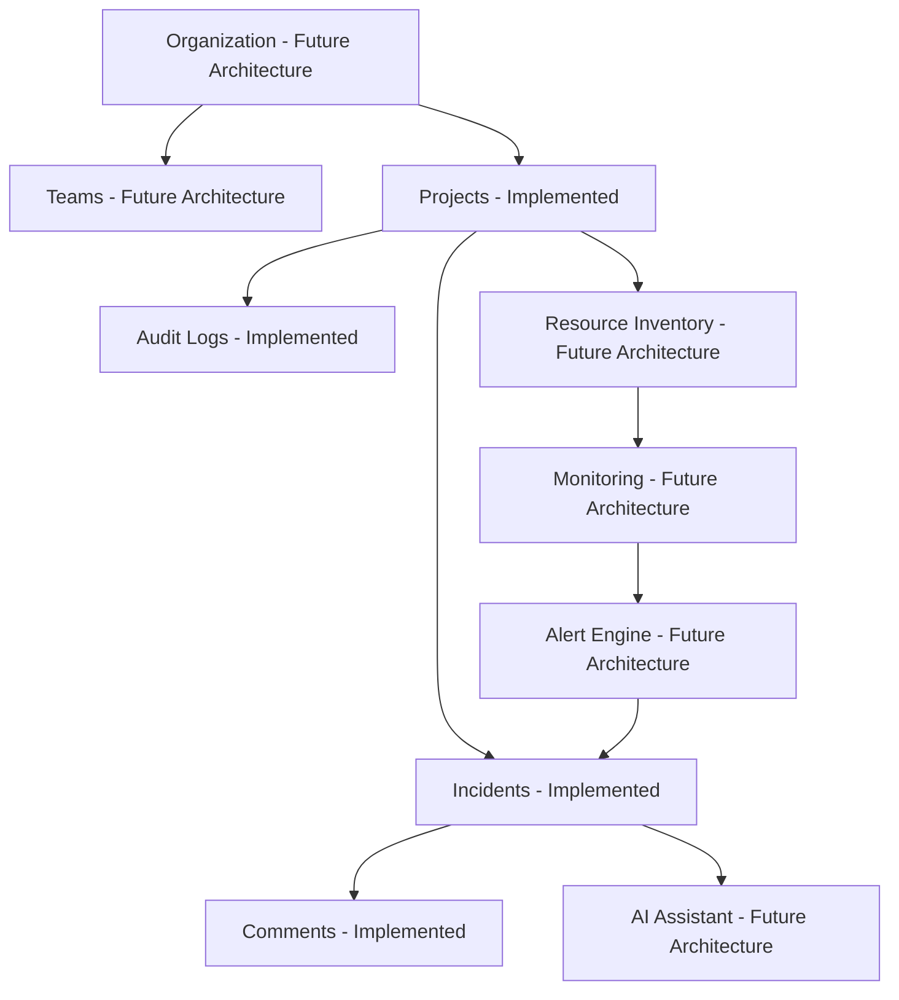

# OpsPilot Engineering Architecture

Version: 2.0
Status: Living Design Document
Owners: Platform Architecture Group

## Vision
OpsPilot is an AI-powered engineering operations platform built to reduce Mean Time To Detect (MTTD) and Mean Time To Resolve (MTTR) across production environments.

OpsPilot is not a generic ticketing or dashboard product. It is an operations system that combines incident execution, project ownership, telemetry context, and AI-assisted diagnosis in one architecture.

## Mission
Build an implementation-first platform that:
- Detects operational risk quickly.
- Turns raw events into incidents with ownership.
- Preserves operational history and auditability.
- Provides AI workflows that shorten investigation and resolution loops.

## Repository Summary
Current implementation summary is maintained in [docs/architecture/REPOSITORY_SUMMARY.md](docs/architecture/REPOSITORY_SUMMARY.md).

## Product Philosophy
### Not
- Jira replacement.
- Trello-style task board.
- Kubernetes-native UI mirror.
- Passive monitoring dashboard.

### Is
- Engineering operations control plane.
- System-of-record for incidents and audit events.
- Bridge between operational data and AI-assisted workflows.

## Domain Model


## High-Level Architecture
### Current Implementation
```mermaid
flowchart LR
  UI[Next.js App Router UI] --> Hooks[React Query Hooks]
  Hooks --> WebServices[Web Service Layer]
  WebServices --> API[Go REST API /api/v1]
  API --> Handlers[Gin Handlers]
  Handlers --> Services[Domain Services]
  Services --> Repos[GORM Repositories]
  Repos --> Postgres[(PostgreSQL)]
  Services --> Audit[(Audit Logs)]
  API --> Metrics[/metrics]
```

### Future Architecture
- Discovery engine for resource graph ingestion.
- Native telemetry pipelines (metrics, logs, traces).
- Alert correlation and incident auto-creation.
- AI assistant with RAG and incident runbooks.

## Folder Structure
### Backend
- `apps/backend/cmd/server`: bootstrap and dependency wiring.
- `apps/backend/internal/router`: route registration.
- `apps/backend/internal/handlers`: HTTP layer.
- `apps/backend/internal/services`: business rules.
- `apps/backend/internal/repository`: data access.
- `apps/backend/internal/models`: persistence schema.

### Frontend
- `apps/web/app`: route segments and layouts.
- `apps/web/components`: feature and shared UI.
- `apps/web/hooks`: React Query hooks.
- `apps/web/services`: HTTP API adapters.
- `apps/web/store`: Zustand auth state.
- `apps/web/types`: API/domain contracts.

### Documentation
- `docs/architecture`: domain architecture documents.
- `docs/database`: data model and schema strategy.
- `docs/api`: endpoint contracts and standards.
- `docs/monitoring`: telemetry and health architecture.
- `docs/ai`: AI architecture and operating model.

## Coding Standards
### Current Standards in Codebase
- Backend layering: handler -> service -> repository.
- No direct DB access from handlers.
- Shared response envelope for API outputs.
- Frontend server-state via React Query.
- Frontend auth state via Zustand.
- Form validation with Zod.

### Why
This separation keeps policy and business logic testable, limits side effects, and enables incremental replacement of integrations without route-level churn.

## Definition of Done
A feature is complete when it includes:
- Backend endpoint(s) and service logic.
- Frontend integration with loading/error/empty states.
- Validation and type-safe contracts.
- Audit and security implications reviewed.
- Documentation updates and operational notes.

## Scalability Strategy
### Current Implementation
- Stateless API process.
- PostgreSQL as source of truth.
- In-memory per-instance rate limiter.
- Prometheus-compatible endpoint.

### Future Architecture
- Horizontal API scale with distributed rate limiting.
- Caching layer for hot query paths.
- Event-driven background processing.
- Multi-org tenancy partition model.

## AI Strategy
### Current Implementation
- No production AI runtime yet.
- Data prerequisites implemented: incidents, comments, audit trail.

### Future Architecture
- RAG over incident history, runbooks, and docs.
- Root-cause assistant with graph-backed context.
- Recommendation engine with confidence and provenance.

## Monitoring Strategy
### Current Implementation
- HTTP metrics exposed on `/metrics`.
- Health probes: `/health`, `/ready`, `/live`.
- Structured request logging and panic recovery logging.

### Future Architecture
- OpenTelemetry traces.
- External telemetry sinks (Prometheus/Grafana, Azure Monitor).
- Service-level objectives and burn-rate alerts.

## Security Philosophy
### Current Implementation
- JWT auth for protected routes.
- Ownership checks in service layer.
- Security headers middleware.
- Per-IP rate limiting.
- Field-level audit logging.

### Future Architecture
- RBAC and team scopes.
- SSO/OIDC integration.
- Secret management lifecycle and rotation.
- Policy-driven data access boundaries.

## Roadmap
- Phase 1 (Implemented): Auth, projects, incidents, comments, dashboard, audit logs.
- Phase 2 (Future Architecture): Resource discovery and monitoring ingestion.
- Phase 3 (Future Architecture): Alert engine and incident automation.
- Phase 4 (Future Architecture): AI assistant, RAG, root cause analysis, auto-remediation.

## Related Documents
- `docs/architecture/REPOSITORY_SUMMARY.md`
- `docs/database/DATABASE.md`
- `docs/api/API_GUIDELINES.md`
- `docs/monitoring/HEALTH_ENGINE.md`
- `docs/ai/AI_ASSISTANT.md`
