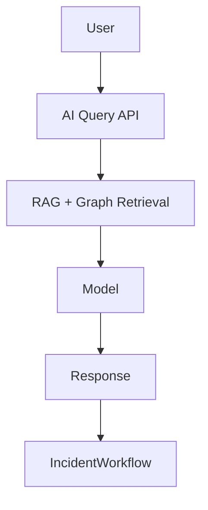

# AI Assistant

## Architecture
### Current Implementation
- No AI assistant runtime in backend/frontend.
- Operational context available: projects, incidents, comments, audit logs.

### Future Architecture

## Embeddings
### Current Implementation
- Not implemented.

### Future Architecture
- Embed incidents, comments, runbooks, and postmortems.
- Periodic re-embedding on content update.

## Context Retrieval
- Future Architecture: hybrid retrieval (semantic + metadata filters by project and time).

## Prompt Strategy
- Future Architecture: prompt templates by intent (triage, RCA, remediation planning).

## Conversation Memory
- Future Architecture: short-term session memory + long-term org memory with TTL and governance.

## Incident Analysis
- Future Architecture: incident context packs with timeline and evidence links.

## Root Cause Analysis
- Future Architecture: ranked hypotheses with confidence and supporting signals.

## Future AI Agents
- Triage agent.
- RCA agent.
- Change-risk agent.
- Remediation-planning agent.

## Related
- `docs/ai/RAG.md`
- `docs/ai/KNOWLEDGE_GRAPH.md`
