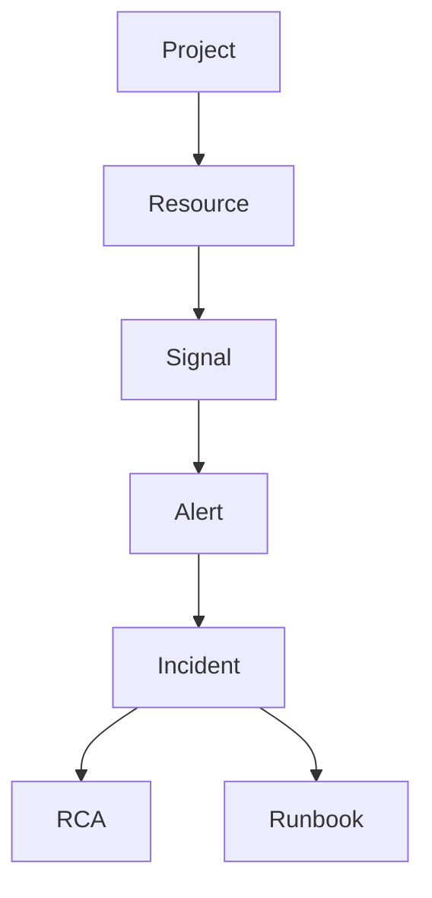

# Knowledge Graph

## Architecture
### Current Implementation
- Not implemented.

### Future Architecture

## Embeddings
- Graph nodes can reference vector embeddings for hybrid retrieval.

## Context Retrieval
- Traverse incident -> resource -> dependency neighborhoods.

## Prompt Strategy
- Feed graph paths as causal evidence chains.

## Conversation Memory
- Maintain graph-centric context window around active incident.

## Incident Analysis
- Identify blast radius via dependency traversal.

## Root Cause Analysis
- Rank root-cause candidates by graph centrality and recent anomalies.

## Future AI Agents
- Graph update validator.
- Dependency impact analyzer.

## Tradeoffs
- Graph modeling improves causality but increases ingestion complexity.

## Open Questions
- Canonical edge types and confidence scoring.

## Related
- `docs/ai/RAG.md`
- `docs/architecture/RESOURCE_INVENTORY.md`
