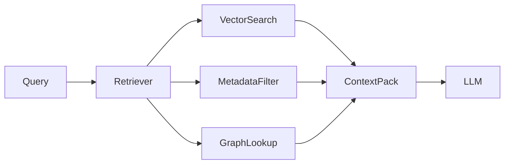

# Retrieval-Augmented Generation (RAG)

## Architecture
### Current Implementation
- Not implemented.

### Future Architecture

## Embeddings
- Future Architecture: domain-specific embeddings for incidents, logs summaries, and runbooks.

## Context Retrieval
- Future Architecture: top-k semantic retrieval + strict project scoping filters.

## Prompt Strategy
- Inject provenance snippets and confidence metadata.

## Conversation Memory
- Use recent conversation turns and previous incident context.

## Incident Analysis
- Retrieve similar incidents and applied fixes.

## Root Cause Analysis
- Rank likely causes from correlated evidence.

## Future AI Agents
- Retrieval planner and verifier agents.

## Tradeoffs
- Large context improves grounding but increases latency and cost.

## Open Questions
- Optimal chunking strategy.
- Freshness SLA for new incident ingestion.

## Related
- `docs/ai/VECTOR_DATABASE.md`
- `docs/ai/PROMPTS.md`
