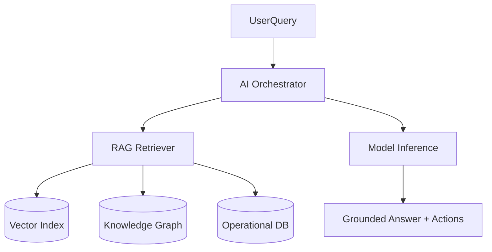
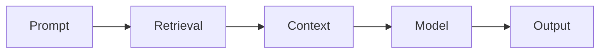

# AI Architecture

## Problem Statement
AI must operate as an engineering copilot with grounded infrastructure context, not as a generic chatbot detached from operations data.

## Goals
- Deliver context-aware troubleshooting and RCA assistance.
- Ground responses in incident, audit, and telemetry evidence.
- Keep human operators in control of remediation actions.

## Non Goals
- Autonomous infrastructure mutation in initial phases.
- Black-box recommendations without provenance.

## User Journey
- Engineer asks operational question.
- AI retrieves relevant incidents, telemetry, and runbooks.
- AI returns explanation, confidence, and recommended actions.

## Architecture
### Current Implementation
- No runtime AI service integrated.
- Foundational operational datasets available: projects, incidents, comments, audit logs.

### Future Architecture

## Data Flow
1. User prompt classified by intent.
2. Retrieval from vector index, knowledge graph, and live operational DB.
3. Context-pack generation with provenance.
4. Inference with policy constraints.
5. Response plus actionable recommendations.

## Component Diagram

## Future Expansion
- Agentic runbooks.
- Incident prediction models.
- Feedback loops for recommendation quality.

## Tradeoffs
- Rich retrieval improves quality but increases latency.
- Strong guardrails reduce risk but may reduce autonomy.

## Open Questions
- Ground truth evaluation framework.
- Prompt/data redaction policy.
- Human approval boundaries for automated actions.

## Related
- `docs/ai/AI_ASSISTANT.md`
- `docs/ai/RAG.md`
