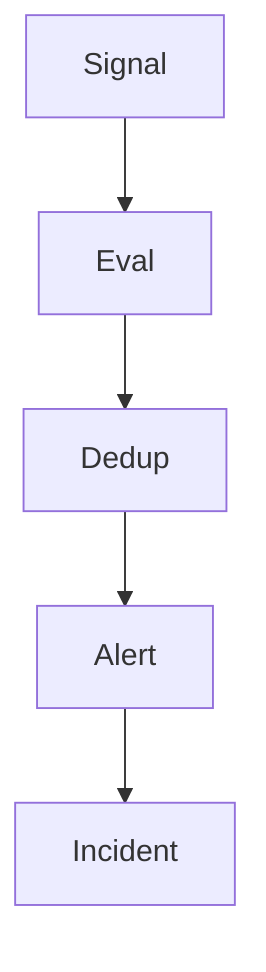

# Alert Engine

## Problem Statement
OpsPilot needs deterministic alert generation and deduplication to avoid alert storms and noisy incident queues.

## Goals
- Convert telemetry signals into normalized alerts.
- Deduplicate by fingerprint and time window.
- Escalate severity based on impact and persistence.

## Non Goals
- Pager replacement in initial phase.
- Full ML-only alerting in MVP.

## User Journey
- Alert conditions fire.
- Similar alerts are grouped.
- Incident is created or updated with correlated evidence.

## Architecture
### Current Implementation
- Not implemented.

### Future Architecture

## Data Flow
1. Evaluate incoming telemetry against alert rules.
2. Build alert fingerprint.
3. Merge or create alert record.
4. Apply severity policy.
5. Notify incident engine.

## Component Diagram

## Future Expansion
- Dynamic thresholds.
- Dependency-aware suppression.
- Maintenance window policies.

## Tradeoffs
- Deterministic rules are transparent but less adaptive.
- Adaptive alerting reduces noise but may reduce explainability.

## Open Questions
- Fingerprint dimensions per signal type.
- Escalation policy ownership model.
- Alert retention and archival policy.

## Related
- `docs/architecture/INCIDENT_ENGINE.md`
- `docs/monitoring/ALERT_RULES.md`
