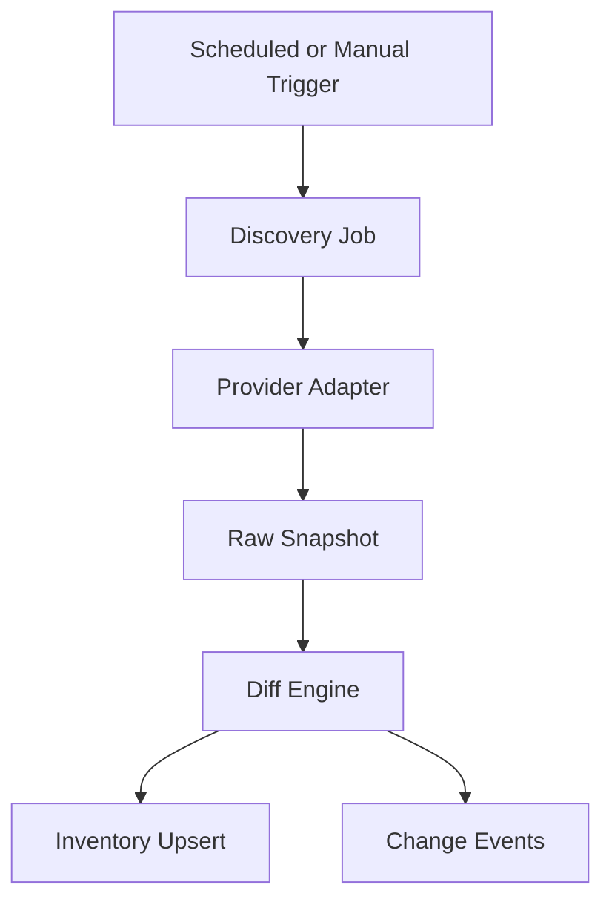

# Discovery Engine

## Problem Statement
Ops teams lose time when infrastructure context is manually maintained. Discovery must continuously produce accurate topology for operational workflows.

## Goals
- Discover resources per project automatically.
- Maintain idempotent, repeatable sync cycles.
- Emit change events for downstream systems.

## Non Goals
- Real-time streaming inventory on day one.
- Universal provider coverage in MVP.

## User Journey
- Operator connects provider credentials.
- Discovery run starts and status is visible.
- New resources appear in project inventory.

## Architecture
### Current Implementation
- Not implemented.

### Future Architecture

## Data Flow
1. Trigger discovery run.
2. Adapter fetches provider inventory.
3. Diff engine compares with prior snapshot.
4. Apply inserts/updates/deletes.
5. Publish change events.

## Component Diagram

## Future Expansion
- Drift scoring.
- Auto-classification of critical resources.
- Dependency graph propagation.

## Tradeoffs
- Polling is simpler than event-driven hooks but increases stale windows.
- Per-provider adapters are explicit but increase maintenance cost.

## Open Questions
- Credential rotation and secret access model.
- Maximum run duration and retry policy.
- Resource ownership conflict resolution.

## Related
- `docs/architecture/RESOURCE_INVENTORY.md`
- `docs/database/DATABASE.md`
