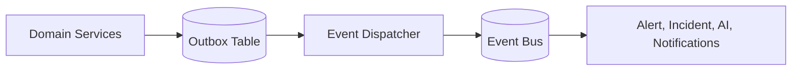
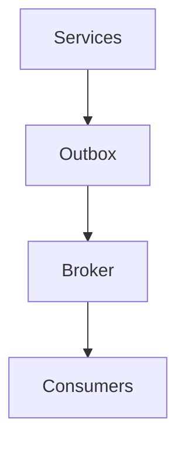

# Event Architecture

## Problem Statement
Ops workflows require consistent event propagation between discovery, monitoring, alerts, incidents, and AI analysis.

## Goals
- Define canonical domain events.
- Support replay and auditability.
- Decouple producers from consumers.

## Non Goals
- Global event bus replacement in MVP.
- Exactly-once semantics across all consumers initially.

## User Journey
- System emits operational events.
- Downstream engines consume and enrich context.
- Engineers inspect event-linked incident history.

## Architecture
### Current Implementation
- Event flow is synchronous inside service calls.
- Audit logs act as historical event trace for mutable entities.

### Future Architecture

## Data Flow
1. Domain write completes with outbox insert.
2. Dispatcher publishes events to bus.
3. Consumers process with idempotency keys.
4. Failures are retried via dead-letter policies.

## Component Diagram

## Future Expansion
- Event schema registry.
- Tenant-aware event routing.
- Exactly-once on selected critical streams.

## Tradeoffs
- Outbox increases write complexity but prevents lost events.
- Async processing improves resilience but introduces eventual consistency.

## Open Questions
- Broker choice (Kafka/Event Hubs/NATS).
- Event retention and replay windows.
- Versioning and compatibility policy.

## Related
- `docs/architecture/ALERT_ENGINE.md`
- `docs/architecture/AI_ARCHITECTURE.md`
