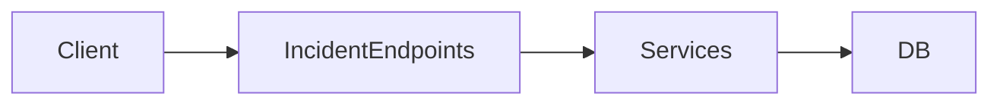

# Incident Engine

## Problem Statement
Incidents must be generated and managed as first-class operational objects with ownership, timeline, and auditability.

## Goals
- Track incident lifecycle with strict state transitions.
- Preserve investigation trail and comments.
- Enforce ownership boundaries.

## Non Goals
- ITSM workflow parity.
- Full chatops integration in MVP.

## User Journey
### Current Implementation
- User creates incident manually.
- User updates status/severity/project.
- User adds comments.
- System records audit logs.

### Future Architecture
- Alert engine creates incidents automatically.
- Timeline includes telemetry snapshots.
- RCA artifacts attached to incident record.

## Architecture
### Current Implementation
```mermaid
flowchart TD
  API[Incident API] --> Handler
  Handler --> Service
  Service --> IncidentRepo
  Service --> CommentRepo
  Service --> AuditService
  IncidentRepo --> Postgres
  CommentRepo --> Postgres
  AuditService --> Postgres
```

## Data Flow
1. Validate request payload and auth context.
2. Authorize project ownership.
3. Persist incident/comment update.
4. Emit audit log entries for mutable fields.

## Component Diagram


## Future Expansion
- Incident state machine guardrails.
- Assignment and on-call workflows.
- Auto-remediation execution hooks.

## Tradeoffs
- Manual incident creation is reliable but increases MTTD.
- Strict ownership checks improve safety but limit cross-team operations.

## Open Questions
- Required workflow for incident closure approvals.
- Comment edit/delete retention policy.
- Cross-project incident linkage model.

## Related
- `docs/api/INCIDENT_API.md`
- `docs/database/DATA_MODEL.md`
