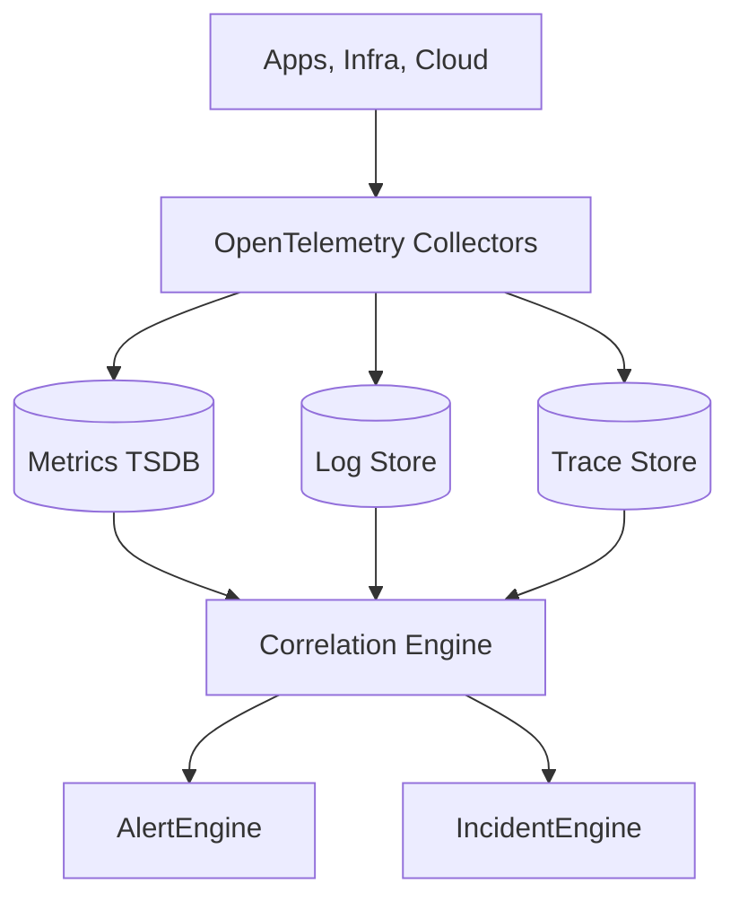
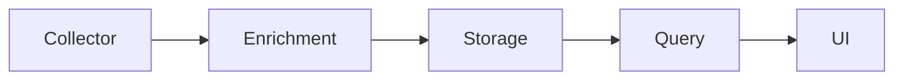

# Monitoring Architecture

## Problem Statement
Current implementation exposes service operational metrics but does not ingest infrastructure telemetry required for proactive operations.

## Goals
- Establish telemetry ingestion architecture for metrics, logs, and traces.
- Correlate telemetry with projects and resources.
- Support alerting and incident generation workflows.

## Non Goals
- Building a full Prometheus replacement.
- Rebuilding cloud-provider observability stacks.

## User Journey
- Engineer selects project.
- Engineer views telemetry aligned to incidents.
- Engineer inspects timeline leading to outage.

## Architecture
### Current Implementation
- API-level metrics endpoint (`/metrics`).
- Health probes and request logs.
- No resource-level telemetry ingestion.

### Future Architecture

## Data Flow
1. Collect telemetry via OTel + provider adapters.
2. Enrich with project/resource metadata.
3. Persist in specialized stores.
4. Run correlation to detect anomalies and trigger alerts.

## Component Diagram

## Future Expansion
- SLO burn-rate detection.
- Cross-signal root-cause hints.
- Seasonality-aware anomaly models.

## Tradeoffs
- Unified pipeline improves consistency but increases ingestion complexity.
- Multi-store design improves query performance but adds operational overhead.

## Open Questions
- Default retention by telemetry type.
- Tenant isolation strategy for telemetry datasets.
- Backfill strategy for historical ingestion.

## Related
- `docs/monitoring/METRICS.md`
- `docs/monitoring/LOGS.md`
- `docs/monitoring/TRACES.md`
