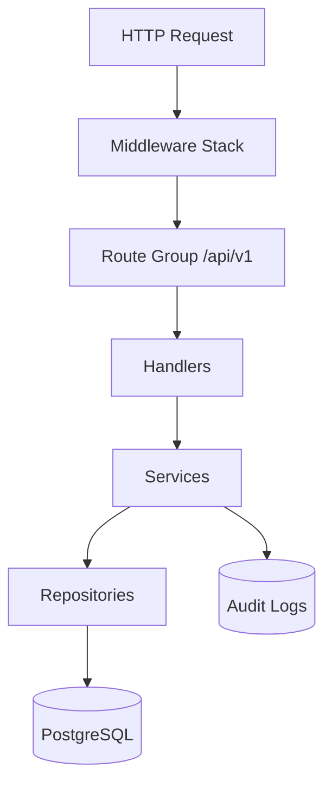
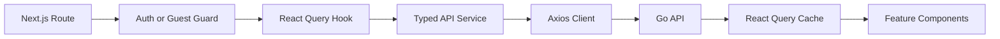

# Repository Summary

## Problem Statement
OpsPilot documentation must reflect real implementation details, not aspirational architecture. This summary provides the current, code-verified baseline before any forward-looking design work.

## Current Product Slice (Implemented)
- Authentication: register/login/me with JWT bearer auth.
- Projects: CRUD, owner scoping, soft delete, slug generation.
- Incidents: CRUD, severity/status validation, owner scoping.
- Comments: CRUD scoped to incident ownership.
- Audit Logs: create/update/delete events for project, incident, comment.
- Dashboard: summary, activity, incident stats, synthetic service health.
- Ops endpoints: `/health`, `/ready`, `/live`, `/metrics`.

## Backend Architecture Snapshot

### Middleware in Request Path
- Request ID generation and propagation.
- Security headers.
- Metrics collection.
- Request logging.
- Per-IP token bucket rate limiting.
- Panic recovery.
- JWT auth on protected route groups.

## Frontend Architecture Snapshot

## Database Snapshot
### Current Tables
- `users`
- `projects`
- `incidents`
- `comments`
- `audit_logs`

### Key Relationships
- users 1:N projects
- users 1:N incidents
- incidents 1:N comments
- projects/incidents/comments -> audit_logs via entity metadata + optional FKs

## API Surface Snapshot
### Public
- `POST /api/v1/auth/register`
- `POST /api/v1/auth/login`

### Protected
- `GET /api/v1/users/me`
- Project CRUD + project audit logs.
- Incident CRUD + incident audit logs.
- Comment CRUD.
- Dashboard summary/activity/stats/services/recent-incidents.

### Operational
- `GET /health`
- `GET /ready`
- `GET /live`
- `GET /metrics`

## Known Gaps
- Audit page in frontend is placeholder.
- Settings page in frontend is placeholder.
- No resource discovery or monitoring ingestion pipeline yet.
- Dashboard service health is synthetic, not telemetry-derived.
- No RBAC, no multi-tenant org/team model.

## Why This Baseline Matters
Every architecture and roadmap document must anchor to this current state to prevent implementation drift, avoid false claims, and support predictable delivery planning.
