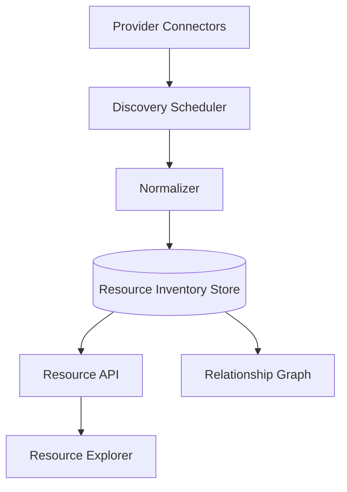
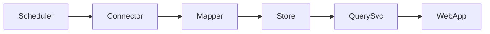

# Resource Inventory Architecture

## Problem Statement
OpsPilot needs a normalized, queryable resource inventory to connect operational symptoms (incidents/alerts) to infrastructure ownership and topology.

## Goals
- Build project-scoped resource graph as system-of-record.
- Link incidents and alerts to concrete resources.
- Support provider-specific metadata without breaking core schema.

## Non Goals
- Replacing cloud-native consoles.
- Real-time config drift remediation in v1.

## User Journey
- Engineer opens project.
- Engineer views discovered resources and hierarchy.
- Engineer pivots from incident to impacted resource set.

## Architecture
### Current Implementation
- No resource inventory persistence yet.
- Project model includes counters (`services`, `members`) but no discovered resource entities.

### Future Architecture

## Data Flow
1. Connector polls provider APIs.
2. Raw objects normalized into canonical resource schema.
3. Upsert by provider identity + project scope.
4. Emit resource-change events for monitoring and alert engines.

## Component Diagram

## Future Expansion
- Multi-cloud resources.
- Namespace/service/deployment deep links.
- Cost and ownership overlays.

## Tradeoffs
- Strict schema gives consistency but slower onboarding of new providers.
- JSON metadata improves flexibility but reduces relational query ergonomics.

## Open Questions
- Source-of-truth conflict policy across providers.
- Refresh cadence per resource class.
- Soft-delete retention window.

## Related
- `docs/database/DATA_MODEL.md`
- `docs/architecture/DISCOVERY_ENGINE.md`
