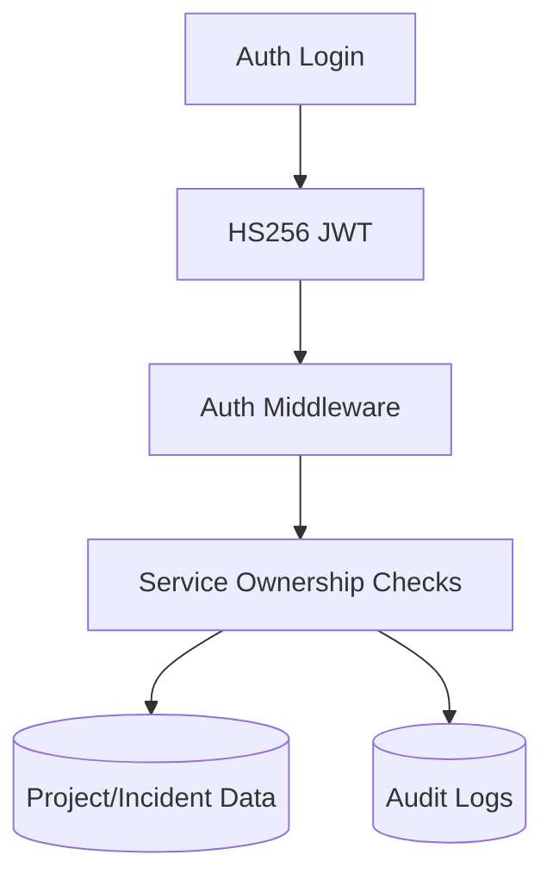
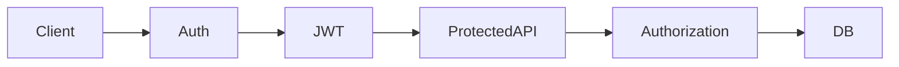

# Security Architecture

## Problem Statement
Operational systems require strict access boundaries and complete action traceability to remain trustworthy during incident response.

## Goals
- Protect API access and project data boundaries.
- Capture immutable operational audit trails.
- Provide secure defaults for HTTP surface.

## Non Goals
- Enterprise IAM parity in current phase.
- Full zero-trust network stack in app process.

## User Journey
- User authenticates with credentials.
- API validates JWT and project ownership.
- Sensitive writes are logged in audit history.

## Architecture
### Current Implementation

Security controls implemented:
- JWT bearer authentication.
- Ownership-based authorization in services.
- Security headers middleware.
- Per-IP rate limiting with Retry-After.
- Panic recovery and structured error logging.

### Future Architecture
- RBAC with role scopes.
- SSO/OIDC integration.
- Secret rotation and key management policy.
- Fine-grained policy checks on resource graph.

## Data Flow
1. Credentials validated during login.
2. JWT token issued and presented on protected routes.
3. Middleware validates token and injects user context.
4. Services enforce ownership before data mutation.
5. Audit logs capture CUD operations.

## Component Diagram

## Future Expansion
- Service-to-service auth.
- Session revocation lists.
- Threat detection hooks.

## Tradeoffs
- HS256 is simple and fast but centralizes key risk.
- Ownership checks are clear but not role-flexible.

## Open Questions
- Migration path from ownership model to RBAC.
- Token revocation strategy.
- Data retention for audit logs under compliance policies.

## Related
- `docs/api/API_GUIDELINES.md`
- `docs/database/DATABASE.md`
