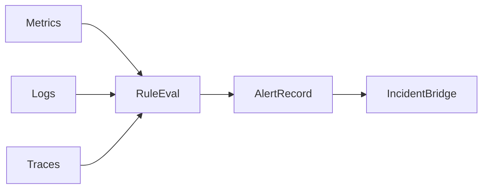
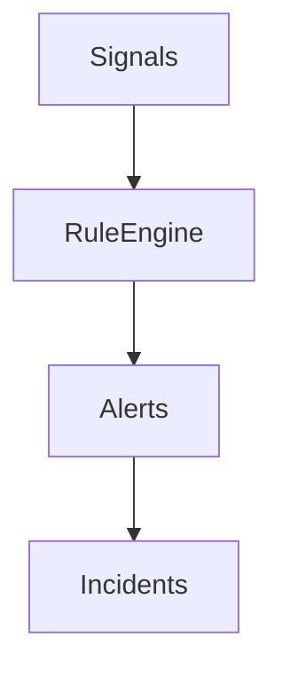

# Alert Rules

## Problem Statement
Alert rules must detect real risk while minimizing noise and duplicate paging.

## Collection Architecture
### Current Implementation
- No backend alert rule engine.
- Operators rely on external systems and dashboard visibility.

### Future Architecture
- Centralized rule definitions with per-project overrides.

## Data Flow

## Component Diagram

## Prometheus Integration
- Future Architecture: rule expressions and alertmanager bridge.

## OpenTelemetry
- Future Architecture: signal unification and semantic conventions.

## Grafana
- Future Architecture: rule dashboards and annotation overlays.

## Azure Monitor
- Future Architecture: map alerts to Action Groups and incident webhooks.

## Future Kubernetes Integration
- Include cluster-level saturation/error budget rules.

## Tradeoffs
- Aggressive thresholds reduce misses but increase fatigue.

## Open Questions
- Rule ownership and approval workflow.
- Dedup window defaults.

## Related
- `docs/architecture/ALERT_ENGINE.md`
- `docs/architecture/INCIDENT_ENGINE.md`
