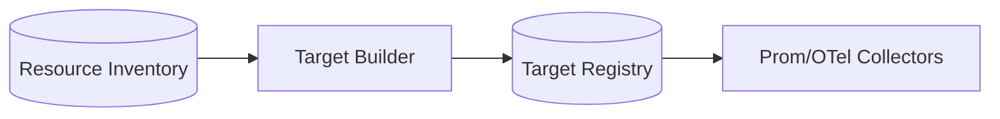
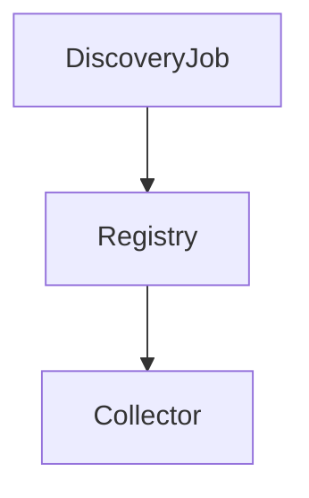

# Monitoring Discovery Engine

## Problem Statement
Telemetry collection requires automatic target discovery; manual scrape configuration does not scale in dynamic environments.

## Collection Architecture
### Current Implementation
- No telemetry target discovery in backend.

### Future Architecture
- Discover scrape targets from resource inventory and platform metadata.

## Goals
- Auto-register monitoring targets.
- Track target lifecycle and health.
- Support Kubernetes and non-Kubernetes environments.

## Data Flow

## Component Diagram

## Prometheus Integration
- Future Architecture: emit scrape configs or service discovery endpoints.

## OpenTelemetry
- Future Architecture: emit receiver configs for discovered endpoints.

## Grafana
- Future Architecture: auto-provision dashboards by discovered service class.

## Azure Monitor
- Future Architecture: sync discovered target metadata into Azure Monitor dimensions.

## Future Kubernetes Integration
- Support ServiceMonitor/PodMonitor style discovery and annotation-based scraping.

## Tradeoffs
- Dynamic discovery reduces ops toil but increases control-plane complexity.

## Open Questions
- Discovery source priority when providers disagree.
- Deletion grace period for stale targets.

## Related
- `docs/architecture/DISCOVERY_ENGINE.md`
- `docs/monitoring/METRICS.md`
