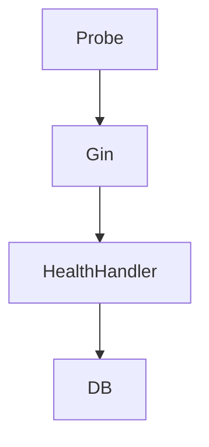

# Health Engine

## Problem Statement
Platform reliability depends on clear liveness/readiness semantics and fast fault isolation.

## Collection Architecture
### Current Implementation
- `/live` checks process liveness only.
- `/ready` validates initialization flag and database reachability.
- `/health` returns environment, version, uptime, and DB status.

### Why
Separating probes prevents unnecessary restarts when dependencies are transiently unavailable.

## User Journey
- Orchestrator probes endpoints.
- Traffic routed only to ready instances.
- Operators inspect health payload for service diagnostics.

## Data Flow
```mermaid
flowchart LR
  K8sProbe --> Endpoint[/live|/ready|/health]
  Endpoint --> Handler[HealthHandler]
  Handler --> DBPing[database.Ping]
  Handler --> JSON[Probe Response]
```

## Component Diagram


## Prometheus Integration
- Complementary to health endpoints; request and panic metrics exposed at `/metrics`.

## OpenTelemetry
- Future Architecture: add trace spans for probe failures and dependency checks.

## Grafana
- Future Architecture: dashboard for readiness flaps, probe latency, and startup duration.

## Azure Monitor
- Future Architecture: map readiness/liveness and health status into Azure Monitor alerts.

## Future Kubernetes Integration
- Current manifests already define startup, readiness, and liveness probes.
- Future Architecture: add probe SLOs and rollout guardrails.

## Tradeoffs
- DB checks in readiness improve safety but can delay rollout under DB incidents.

## Open Questions
- Probe timeout budgets per environment.
- Readiness behavior during graceful degradation modes.

## Related
- `docs/api/MONITORING_API.md`
- `docs/monitoring/METRICS.md`
