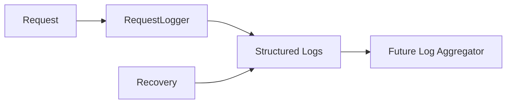
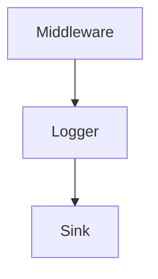

# Logs Architecture

## Problem Statement
Incident response requires structured, queryable logs tied to request IDs and ownership context.

## Collection Architecture
### Current Implementation
- Structured slog logging in backend.
- Request logger captures method/path/status/latency/client IP.
- Errors and recovered panics include diagnostic context.

## Data Flow

## Component Diagram

## Prometheus Integration
- Metrics and logs are complementary; no log-derived metrics pipeline yet.

## OpenTelemetry
- Future Architecture: OTel log pipeline with correlation IDs.

## Grafana
- Future Architecture: Loki/Grafana dashboards by request ID and route.

## Azure Monitor
- Future Architecture: ship logs to Log Analytics with Kusto-ready schema.

## Future Kubernetes Integration
- Adopt sidecar or daemonset collectors; preserve JSON structure.

## Tradeoffs
- Local stdout logging is simple but limited for cross-service correlation.

## Open Questions
- PII redaction standards.
- Log retention tiers per environment.

## Related
- `docs/architecture/SECURITY_ARCHITECTURE.md`
- `docs/monitoring/TRACES.md`
