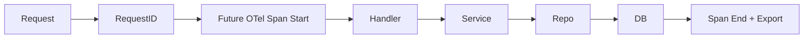
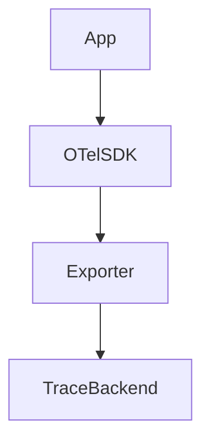

# Traces Architecture

## Problem Statement
Without distributed tracing, cross-service latency and causal bottlenecks are hard to diagnose quickly.

## Collection Architecture
### Current Implementation
- No distributed tracing.
- Request IDs are generated and returned as `X-Request-ID`.

### Future Architecture
- Introduce OpenTelemetry spans across API, DB, and downstream integrations.

## Data Flow

## Component Diagram

## Prometheus Integration
- Correlate trace latency percentiles with metric dashboards.

## OpenTelemetry
- Future Architecture: mandatory context propagation in middleware.

## Grafana
- Future Architecture: Tempo integration and exemplars.

## Azure Monitor
- Future Architecture: Application Insights ingestion for trace graphs.

## Future Kubernetes Integration
- Auto-instrument workloads and collectors in cluster.

## Tradeoffs
- Tracing increases overhead; selective sampling needed.

## Open Questions
- Sampling strategy by endpoint criticality.
- Trace retention and cost controls.

## Related
- `docs/monitoring/METRICS.md`
- `docs/architecture/EVENT_ARCHITECTURE.md`
